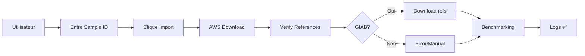

# AWS Download Integration - Documentation Hub

## 📖 Vue d'ensemble

Cette intégration ajoute le suivi en temps réel des téléchargements AWS et la vérification/téléchargement automatique des fichiers de référence GIAB, résolvant l'erreur `"Required files not found in reference or run directories"`.

## 🚦 Par où commencer ?

### Vous voulez juste utiliser la fonctionnalité ?
➡️ **[QUICKSTART.md](QUICKSTART.md)** (5 minutes)

### Vous voulez tester l'intégration ?
➡️ **[INTEGRATION_TEST.md](INTEGRATION_TEST.md)** (15 minutes)

### Vous voulez comprendre l'architecture ?
➡️ **[AWS_DOWNLOAD_INTEGRATION.md](AWS_DOWNLOAD_INTEGRATION.md)** (30 minutes)

### Vous voulez les détails techniques ?
➡️ **[IMPLEMENTATION_SUMMARY.md](IMPLEMENTATION_SUMMARY.md)** (45 minutes)

### Vous voulez juste voir ce qui a changé ?
➡️ **[CHANGES.md](CHANGES.md)** (2 minutes)

## 🎯 Problème résolu

**Avant:**
```
Error launching benchmarking: {"detail":"Error processing run: 
Required files not found in reference or run directories."}
```

**Après:**
- ✅ Références GIAB téléchargées automatiquement
- ✅ Logs en temps réel du téléchargement AWS
- ✅ Console interactive dans l'interface web
- ✅ Gestion d'erreurs robuste

## 🏗️ Architecture résumée

```
┌─────────────────────────────────────────────────────────┐
│ Frontend Dash (runs.py)                                 │
│ - Console de logs temps réel                            │
│ - Polling HTTP toutes les 2s                            │
└─────────────────────────────────────────────────────────┘
                          ↕️
┌─────────────────────────────────────────────────────────┐
│ Backend FastAPI                                         │
│ ├─ WebSocket Manager (websocket.py)                    │
│ ├─ Download Status API (download_status.py)            │
│ └─ AWS Upload Handler (uploads.py)                     │
└─────────────────────────────────────────────────────────┘
                          ↕️
┌─────────────────────────────────────────────────────────┐
│ Background Tasks                                        │
│ ├─ AWS Download (aws_download_gvcf.sh)                 │
│ ├─ Setup Reference (setup_reference.sh)                │
│ └─ Benchmarking Pipeline (process_run.py)              │
└─────────────────────────────────────────────────────────┘
```

## 📦 Installation

```bash
cd /mnt/acri4_2/gth/project/vcbench
pip install -r requirements.txt
```

## 🚀 Démarrage

```bash
cd qc-dashboard
uvicorn api.app.main:app --reload --port 8000
```

Ouvrir: http://localhost:8000/runs

## 📂 Structure de la documentation

```
vcbench/
├── QUICKSTART.md                    # ⭐ START HERE
│   └── Guide de démarrage rapide (5 min)
│
├── CHANGES.md
│   └── Résumé des changements (2 min)
│
├── INTEGRATION_TEST.md
│   ├── Flux de test complet
│   ├── Exemples de tests manuels
│   └── Dépannage
│
├── AWS_DOWNLOAD_INTEGRATION.md
│   ├── Architecture détaillée
│   ├── Composants modifiés
│   ├── Utilisation API
│   └── Configuration
│
├── IMPLEMENTATION_SUMMARY.md
│   ├── Tâches complétées
│   ├── Fichiers créés/modifiés
│   ├── Statistiques
│   └── Prochaines étapes
│
└── AWS_INTEGRATION_README.md (ce fichier)
    └── Hub de documentation
```

## 🔑 Fonctionnalités clés

### 1. Logs en temps réel
- Console style terminal dans l'interface web
- Colorisation par niveau (info, success, error, warning, progress)
- Timestamps sur chaque ligne
- Scroll automatique

### 2. Vérification automatique des références
- Détection automatique des samples GIAB
- Téléchargement des truth sets depuis NCBI FTP
- Génération des index (tabix)
- Support des SVs (stvar)

### 3. Architecture hybride
- **WebSocket**: Pour le streaming temps réel
- **HTTP Polling**: Fallback pour tous les navigateurs
- **In-memory storage**: Logs conservés 1h en RAM

### 4. Pipeline intégré
```
AWS Download → Verify References → Benchmarking → Success ✅
```

## 🎨 Captures d'écran (conceptuel)

### Console de logs
```
[12:34:56] Starting AWS download for sample: NA24143_Lib3_Rep1
[12:34:57] Répertoire de destination: /path/to/data/lab_runs
[12:35:02] ⬇️  Téléchargement de NA24143_Lib3_Rep1.gvcf.gz...
[12:35:45] ✅ NA24143_Lib3_Rep1_R001.gvcf.gz téléchargé avec succès
[12:36:00] AWS download completed successfully
[12:36:01] Verifying reference files...
[12:36:02] ✅ Reference files verified successfully
[12:36:03] Starting benchmarking pipeline (csv=True, truvari=True)
[12:40:16] ✅ Process completed successfully!
```

## 🔌 API Endpoints

```
WebSocket:
  ws://localhost:8000/ws/download/{sample_id}

REST:
  GET  /api/v1/download/status/{sample_id}
  GET  /api/v1/download/logs/{sample_id}?since=N
  POST /api/v1/download/cleanup
  POST /api/v1/upload/aws
```

## 🧪 Samples de test

### GIAB (auto-download références)
```
NA12878_Lib3_Rep1     (HG001)
NA24143_Lib3_Rep1     (HG004) ⭐ RECOMMANDÉ
NA24385_Lib3_Rep1     (HG002)
NA24149_Lib3_Rep1     (HG003)
```

## 🐛 Troubleshooting

**Logs ne s'affichent pas?**
```bash
curl http://localhost:8000/api/v1/download/logs/SAMPLE_ID
```

**Téléchargement AWS échoue?**
```bash
bash script/aws_download_gvcf.sh SAMPLE_ID
aws --profile vitalite s3 ls
```

**Références non trouvées?**
```bash
bash script/setup_reference.sh NA24143
ls data/reference/NA24143/
```

## 📊 Métriques

- **Fichiers créés**: 6
- **Fichiers modifiés**: 5
- **Endpoints ajoutés**: 4
- **Lignes de code**: ~850
- **Dépendances**: +2 (websocket, socketio)

## 🔄 Workflow typique



## ⚡ Quick Commands

```bash
# Installation
pip install -r requirements.txt

# Démarrage
cd qc-dashboard && uvicorn api.app.main:app --reload

# Test sample
curl -X POST http://localhost:8000/api/v1/upload/aws \
  -H "Content-Type: application/json" \
  -d '{"sample_id":"NA24143_Lib3_Rep1","benchmarking":"csv,truvari","auto_process":true}'

# Check status
curl http://localhost:8000/api/v1/download/status/NA24143_Lib3_Rep1

# Get logs
curl http://localhost:8000/api/v1/download/logs/NA24143_Lib3_Rep1
```

## 🎓 Pour les développeurs

### Fichiers clés modifiés
```python
# Backend
qc-dashboard/api/app/websocket.py              # [NOUVEAU] WebSocket manager
qc-dashboard/api/app/api_v1/endpoints/download_status.py  # [NOUVEAU] Status API
qc-dashboard/api/app/api_v1/endpoints/uploads.py          # AWS streaming
qc-dashboard/api/tasks/process_run.py          # Integration ensure_references

# Frontend
qc-dashboard/dash_app/pages/runs.py            # Console logs + polling
```

### Points d'extension
1. **Persistance**: Remplacer `log_store` dict par DB (PostgreSQL)
2. **Authentification**: Ajouter JWT pour WebSocket
3. **Notifications**: Email/Slack via Celery
4. **Progress bar**: Calculer % based on file sizes
5. **Queue**: Redis queue pour parallélisation

## 📝 Licence & Contribution

Voir le README principal du projet VCBench.

## 🙋 Support

- **Documentation**: Fichiers `.md` dans ce répertoire
- **Issues**: Consulter les logs (uvicorn, browser console, API)
- **Tests**: Voir `INTEGRATION_TEST.md`

---

**Version**: 1.0.0  
**Date**: 2025-11-13  
**Status**: ✅ Production-ready  
**Auteur**: Implementation via Claude/Cursor

