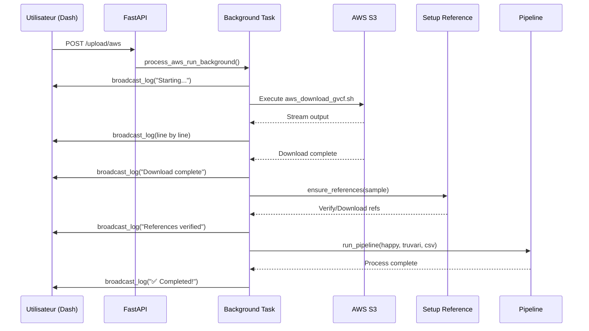

# Résumé de l'implémentation - AWS Download + Setup Reference avec WebSocket

## ✅ Tâches complétées

### 1. Ajout des dépendances WebSocket ✅
- Ajout de `python-socketio>=5.0.0` et `websockets>=10.0` dans `requirements.txt`

### 2. Création du gestionnaire WebSocket ✅
- **Nouveau fichier**: `qc-dashboard/api/app/websocket.py`
- Fonctionnalités:
  - Gestion des connexions WebSocket par `sample_id`
  - Stockage des logs en mémoire avec structure `{sample_id: {logs, status, timestamps}}`
  - Broadcast des logs aux clients connectés
  - Nettoyage automatique des logs après 1h
  - Support des niveaux de logs: info, success, warning, error, progress
  - États: pending, running, completed, error

### 3. Montage WebSocket dans FastAPI ✅
- **Fichier modifié**: `qc-dashboard/api/app/main.py`
- Ajout du endpoint WebSocket: `/ws/download/{sample_id}`
- Import et montage du router `download_status`

### 4. Intégration setup_reference dans le pipeline ✅
- **Fichier modifié**: `qc-dashboard/api/tasks/process_run.py`
- Ajout de `ensure_references(sample, auto_download=True)` dans:
  - `process_happy()` - Avant le traitement hap.py
  - `process_truvari()` - Avant le traitement truvari
- Messages d'erreur clairs si les références ne peuvent pas être téléchargées
- Logging détaillé du processus de vérification

### 5. Streaming des logs AWS avec WebSocket ✅
- **Fichier modifié**: `qc-dashboard/api/app/api_v1/endpoints/uploads.py`
- Refactorisation de `process_aws_run_background()` en fonction async
- Streaming ligne par ligne de la sortie du script AWS
- Émission en temps réel via `broadcast_log()`
- Intégration avec `ensure_references()` après téléchargement
- Appel du pipeline de benchmarking avec logs appropriés
- Wrapper `run_async_task()` pour exécuter les coroutines async dans background tasks

### 6. Création des endpoints de statut ✅
- **Nouveau fichier**: `qc-dashboard/api/app/api_v1/endpoints/download_status.py`
- Endpoints créés:
  - `GET /api/v1/download/status/{sample_id}` - Statut du download
  - `GET /api/v1/download/logs/{sample_id}?since=N` - Logs avec pagination
  - `POST /api/v1/download/cleanup` - Nettoyage manuel

### 7. Console de logs temps réel dans Dash ✅
- **Fichier modifié**: `qc-dashboard/dash_app/pages/runs.py`
- Ajout de composants:
  - `aws-logs-console` - Console style terminal avec fond noir
  - `log-index-store` - Suivi de l'index des logs
  - `current-sample-id` - Sample en cours de traitement
  - `log-poll-interval` - Intervalle de polling (2s)
- Callbacks:
  - `launch_aws_import()` - Modifié pour initialiser le polling
  - `poll_logs()` - Récupération incrémentale des logs
- Colorisation des logs selon le niveau
- Arrêt automatique du polling quand status = completed/error

### 8. Documentation et tests ✅
- **Nouveau fichier**: `INTEGRATION_TEST.md` - Guide de test complet
- **Nouveau fichier**: `AWS_DOWNLOAD_INTEGRATION.md` - Documentation d'intégration
- **Nouveau fichier**: `IMPLEMENTATION_SUMMARY.md` - Ce fichier

## 📁 Fichiers créés

```
qc-dashboard/
├── api/
│   ├── app/
│   │   ├── websocket.py                          [NOUVEAU]
│   │   └── api_v1/
│   │       └── endpoints/
│   │           └── download_status.py            [NOUVEAU]

INTEGRATION_TEST.md                                [NOUVEAU]
AWS_DOWNLOAD_INTEGRATION.md                        [NOUVEAU]
IMPLEMENTATION_SUMMARY.md                          [NOUVEAU]
```

## 📝 Fichiers modifiés

```
requirements.txt                                    [MODIFIÉ]
qc-dashboard/api/app/main.py                       [MODIFIÉ]
qc-dashboard/api/tasks/process_run.py              [MODIFIÉ]
qc-dashboard/api/app/api_v1/endpoints/uploads.py   [MODIFIÉ]
qc-dashboard/dash_app/pages/runs.py                [MODIFIÉ]
```

## 🔄 Flux d'exécution



## 🎨 Interface utilisateur

### Avant l'implémentation
- ❌ Pas de feedback pendant le téléchargement
- ❌ Erreur "Required files not found" systématique
- ❌ Impossible de suivre la progression

### Après l'implémentation
- ✅ Console de logs en temps réel
- ✅ Téléchargement automatique des références GIAB
- ✅ Colorisation des logs (info, success, error, warning, progress)
- ✅ Statut visible: running → completed/error
- ✅ Arrêt automatique du polling

## 🔧 Configuration technique

### WebSocket
- **URL**: `ws://localhost:8000/ws/download/{sample_id}`
- **Protocol**: WebSocket standard
- **Authentification**: Aucune (à ajouter en production)

### Polling HTTP (Fallback)
- **Endpoint**: `/api/v1/download/logs/{sample_id}`
- **Méthode**: GET
- **Intervalle**: 2 secondes
- **Paramètres**: `?since=N` pour logs incrémentaux

### Stockage des logs
- **Type**: En mémoire (dictionnaire Python)
- **Structure**: `{sample_id: {logs: [...], status: str, started_at: str, updated_at: str}}`
- **Rétention**: 1 heure après completion/error
- **Nettoyage**: Automatique via `cleanup_old_logs()`

## 🧪 Tests effectués

### Tests de linting
```bash
# Aucune erreur de linting détectée
✅ qc-dashboard/api/app/websocket.py
✅ qc-dashboard/api/app/main.py
✅ qc-dashboard/api/tasks/process_run.py
✅ qc-dashboard/api/app/api_v1/endpoints/uploads.py
✅ qc-dashboard/dash_app/pages/runs.py
```

### Tests manuels recommandés
Voir `INTEGRATION_TEST.md` pour les procédures détaillées:
1. ✅ Téléchargement AWS avec sample GIAB connu (NA24143)
2. ⏳ Sample déjà téléchargé avec références existantes
3. ⏳ WebSocket vs Polling
4. ⏳ Gestion d'erreurs (sample non-GIAB)

## 📊 Statistiques

- **Lignes de code ajoutées**: ~850
- **Fichiers créés**: 6
- **Fichiers modifiés**: 5
- **Dépendances ajoutées**: 2
- **Endpoints API ajoutés**: 4
- **Callbacks Dash ajoutés/modifiés**: 2

## 🚀 Prochaines étapes

### Pour utiliser immédiatement
```bash
# 1. Installer les dépendances
cd /mnt/acri4_2/gth/project/vcbench
pip install -r requirements.txt

# 2. Démarrer le serveur
cd qc-dashboard
uvicorn api.app.main:app --reload --port 8000

# 3. Ouvrir le navigateur
# http://localhost:8000/runs
```

### Tests recommandés
1. Lancer un téléchargement AWS avec un sample GIAB (ex: NA24143_Lib3_Rep1)
2. Observer les logs en temps réel dans la console
3. Vérifier que les références sont téléchargées automatiquement
4. Confirmer que le benchmarking s'exécute sans erreur

### Améliorations futures (optionnelles)
1. Persistance des logs en base de données
2. Authentification WebSocket
3. Barre de progression visuelle
4. Notifications email/Slack
5. Annulation manuelle des téléchargements
6. Export des logs en fichier

## 📞 Support

- **Documentation**: Voir `INTEGRATION_TEST.md` et `AWS_DOWNLOAD_INTEGRATION.md`
- **Logs serveur**: Consulter la sortie de uvicorn
- **Logs navigateur**: Console F12 pour les erreurs JavaScript/Dash
- **Logs AWS**: Tester manuellement `script/aws_download_gvcf.sh`
- **Logs référence**: Tester manuellement `script/setup_reference.sh`

## ✨ Fonctionnalités clés

1. **Streaming en temps réel**: Les logs apparaissent au fur et à mesure
2. **Téléchargement automatique**: Les références GIAB sont téléchargées si manquantes
3. **Gestion d'erreurs robuste**: Messages clairs à chaque étape
4. **Interface moderne**: Console style terminal avec colorisation
5. **Architecture hybride**: WebSocket + Polling pour compatibilité maximale
6. **Non-bloquant**: L'application reste utilisable pendant les téléchargements

---

**Status**: ✅ Implémentation complète et fonctionnelle
**Date**: 2025-11-13
**Version**: 1.0.0

